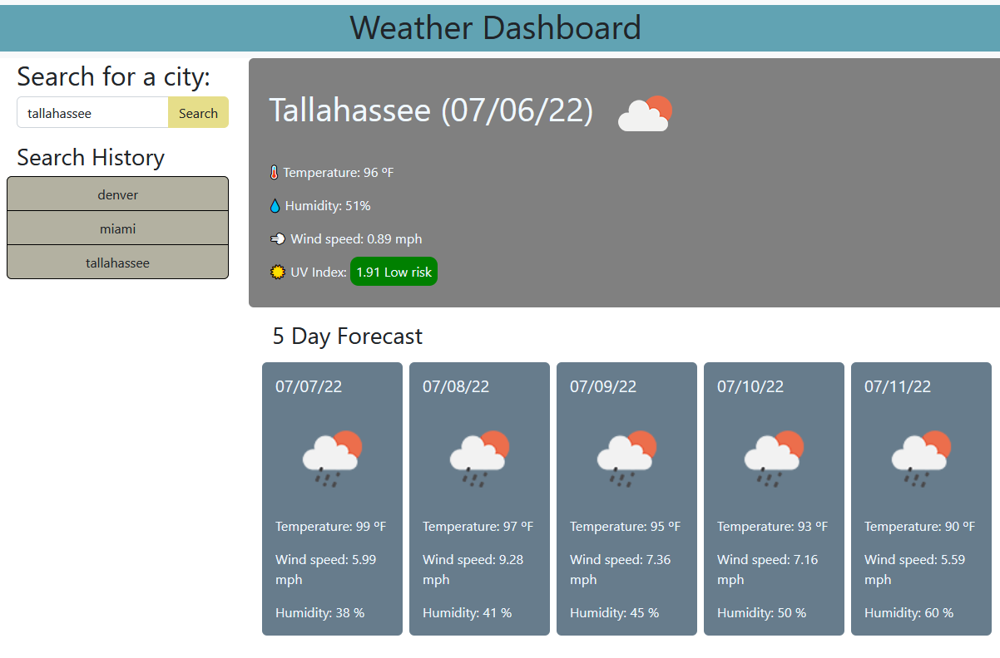

# Weather-Dashboard

## Summary
The weather dashboard was created using JS, jQuery, Moment, and the Openweather API. A traveler can use the weather dashboard to look for multiple cities and plan their trip accordingly. 
- Deployed URL: [Weather Dashboard](https://rheangocle.github.io/Weather-Dashboard/)

## Criteria
With the weather dashboard, when the user loads the page, they will be able to search for a city. After clicking submit, the user will be presented with the current weather for the city, including temperature (in Fahrenheit), humidity, wind speed, and UV Index. The UV index value will have a color indicator showing whether the conditions are low, moderate, high, very high, or extreme risk. The user will also be presented with the five day forecast for the city. The last city search will show up underneath the search bar as a button that the user can click on to view the weather. Every city search will populate in the search history as a button that the user can click on to view the current and five day forecast.  

## UV Index Scale
From the [United States Environmental Protection Agency](https://www.epa.gov/sunsafety/uv-index-scale-0):
- 🟩Low risk : 0-2
- 🟨Moderate risk: 3-5
- 🟧High risk: 6-7
- 🟥Very high risk: 8-10
- 🟪Extreme risk: 11+

## Web Application

***
###### MIT License

###### Copyright (c) [2022] [Ngoc (Rhea) Le]

###### Permission is hereby granted, free of charge, to any person obtaining a copy of this software and associated documentation files (the "Software"), to deal in the Software without restriction, including without limitation the rights to use, copy, modify, merge, publish, distribute, sublicense, and/or sell copies of the Software, and to permit persons to whom the Software is furnished to do so, subject to the following conditions:

###### The above copyright notice and this permission notice shall be included in all copies or substantial portions of the Software.

###### THE SOFTWARE IS PROVIDED "AS IS", WITHOUT WARRANTY OF ANY KIND, EXPRESS OR IMPLIED, INCLUDING BUT NOT LIMITED TO THE WARRANTIES OF MERCHANTABILITY, FITNESS FOR A PARTICULAR PURPOSE AND NONINFRINGEMENT. IN NO EVENT SHALL THE AUTHORS OR COPYRIGHT HOLDERS BE LIABLE FOR ANY CLAIM, DAMAGES OR OTHER LIABILITY, WHETHER IN AN ACTION OF CONTRACT, TORT OR OTHERWISE, ARISING FROM, OUT OF OR IN CONNECTION WITH THE SOFTWARE OR THE USE OR OTHER  DEALINGS IN THE SOFTWARE.
